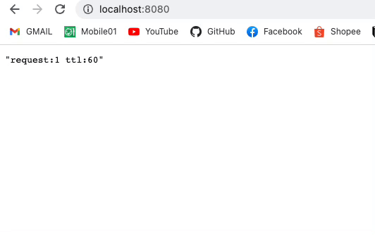

Rate-limit Demo
---

基於呈現觀念的 Demo 範例，簡略了結構，著重於實現 IP 限制之功能

### Run Project (docker-compose)

#### Clone
```
git clone https://github.com/MikeHsu0618/ratelimit-demo.git

cd ./ratelimit-demo
```

#### Run Application
```
docker compose up -d

# 運行成功起後，可於以下路徑請求次數及過期時間
http://localhost:8080
```

#### Run Test
```
go test ./...
```

#### Introduction
使用 Lua 腳本讓 `Incr` 和 `expire` 兩條命令保持原子性，
實際邏輯為以用戶 `IP` 為 key 值, 在 Lua 腳本中使用 `Incr` 指令, 如返回值為初始的 `1`，
則給予 `expire` 過期時間，最後返回次數判斷是否超過需要回傳 `429 too many reqeusts`。

#### Demo
 
